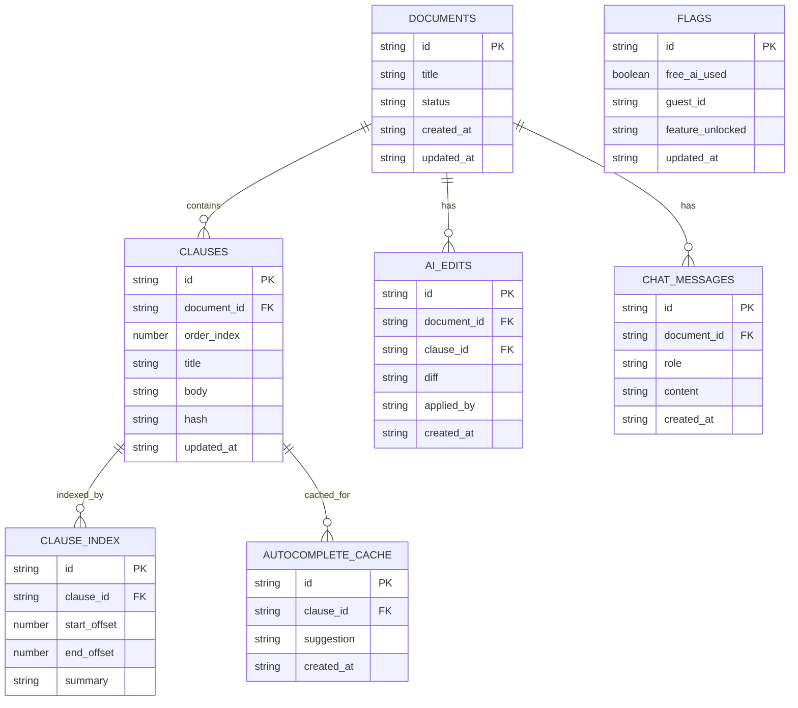
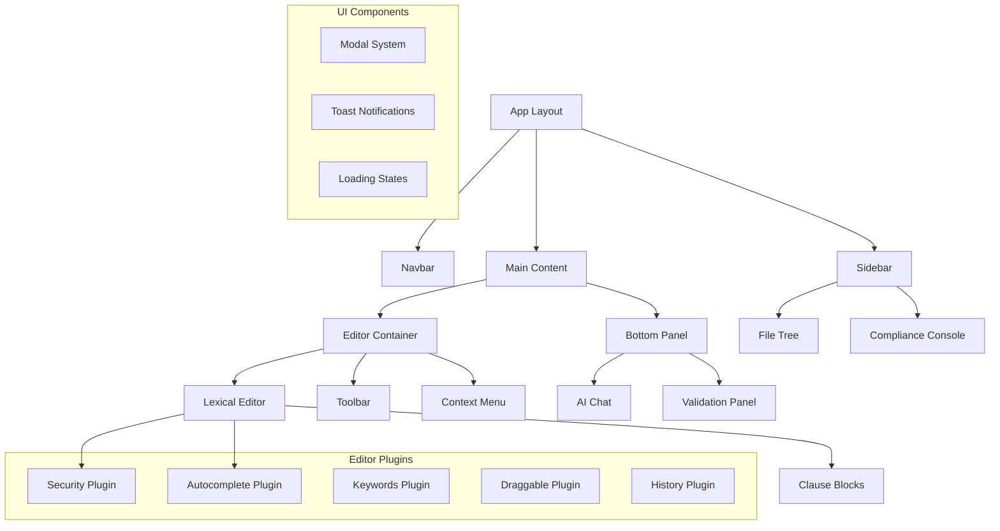
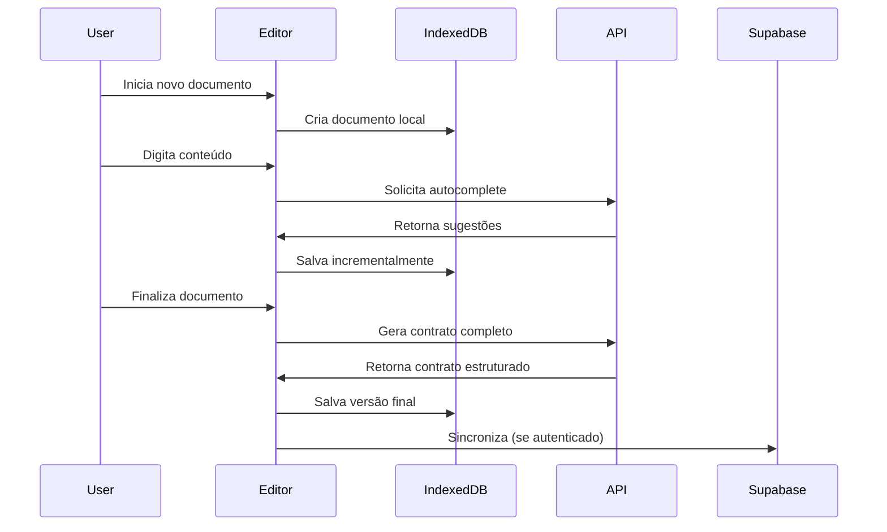
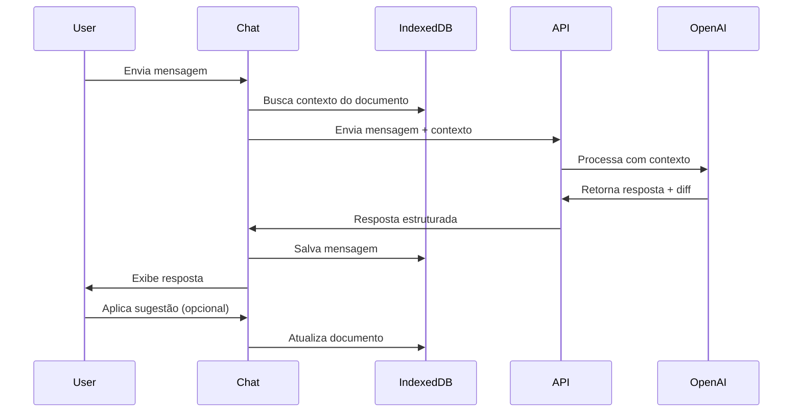

# Arquitetura Técnica - Editor Legal MVP Fase 1

## 1. Arquitetura Geral

```mermaid
graph TD
    A[Cliente Browser] --> B[Next.js Frontend]
    B --> C[IndexedDB Local]
    B --> D[APIs Next.js]
    D --> E[OpenAI API]
    D --> F[Supabase Backend]
    
    subgraph "Frontend Layer"
        B
        G[Lexical Editor]
        H[Shadcn UI]
        I[Dexie.js]
    end
    
    subgraph "API Layer"
        D
        J[/api/autocomplete]
        K[/api/generate-contract]
        L[/api/chat]
        M[/api/export/docx]
        N[/api/validate]
    end
    
    subgraph "Data Layer"
        C
        F
        O[PostgreSQL]
    end
    
    subgraph "External Services"
        E
    end
```

## 2. Stack Tecnológico

### Frontend
- **Next.js 15.5.2** - Framework React com SSR/SSG
- **React 19.1.0** - Biblioteca de UI
- **Lexical 0.35.0** - Editor de texto rico
- **Shadcn UI** - Componentes baseados em Radix
- **TailwindCSS 4** - Framework de CSS utilitário
- **Dexie.js 3.2.4** - Wrapper para IndexedDB

### Backend
- **Next.js API Routes** - Endpoints serverless
- **Supabase** - Backend-as-a-Service
- **PostgreSQL** - Banco de dados relacional

### Serviços Externos
- **OpenAI GPT-3.5/4** - IA para geração e autocomplete

## 3. Definições de Rotas

| Rota | Propósito |
|------|----------|
| `/` | Página principal do editor |
| `/api/autocomplete` | Sugestões de texto via IA |
| `/api/generate-contract` | Geração completa de contratos |
| `/api/chat` | Chat contextual com IA |
| `/api/improve-clause` | Melhoria de cláusulas específicas |
| `/api/export/docx` | Exportação para formato Word |
| `/api/validate` | Validação legal de documentos |
| `/api/auth/*` | Autenticação via Supabase |
| `/api/sync` | Sincronização de dados |

## 4. APIs Detalhadas

### 4.1 API de Autocomplete

**Endpoint**: `POST /api/autocomplete`

**Request**:
```typescript
interface AutocompleteRequest {
  text: string;
  context?: string;
  maxTokens?: number;
}
```

**Response**:
```typescript
interface AutocompleteResponse {
  suggestion: string;
  confidence: number;
  fallback?: boolean;
  error?: string;
}
```

### 4.2 API de Geração de Contratos

**Endpoint**: `POST /api/generate-contract`

**Request**:
```typescript
interface GenerateContractRequest {
  prompt: string;
  contractType: 'service' | 'sale' | 'rental' | 'employment' | 'custom';
  parties: {
    contractor: string;
    contractee: string;
  };
  context?: string;
}
```

**Response**:
```typescript
interface GenerateContractResponse {
  contract: string;
  clauses: Array<{
    id: string;
    title: string;
    content: string;
    order: number;
  }>;
  metadata: {
    wordCount: number;
    estimatedReadTime: number;
    complexity: 'low' | 'medium' | 'high';
  };
}
```

### 4.3 API de Chat IA

**Endpoint**: `POST /api/chat`

**Request**:
```typescript
interface ChatRequest {
  message: string;
  documentId: string;
  clauseId?: string;
  context?: {
    selectedText?: string;
    cursorPosition?: number;
  };
}
```

**Response**:
```typescript
interface ChatResponse {
  response: string;
  suggestions?: string[];
  diff?: {
    operation: 'insert' | 'replace' | 'delete';
    position: number;
    content: string;
  };
  usageCount: number;
  remainingFree: number;
}
```

### 4.4 API de Exportação DOCX

**Endpoint**: `POST /api/export/docx`

**Request**:
```typescript
interface ExportRequest {
  documentId: string;
  format: 'docx';
  options?: {
    includeMetadata: boolean;
    pageNumbers: boolean;
    headerFooter: boolean;
  };
}
```

**Response**: Blob (arquivo .docx)

### 4.5 API de Validação Legal

**Endpoint**: `POST /api/validate`

**Request**:
```typescript
interface ValidateRequest {
  documentId: string;
  content: string;
  validationType: 'cpf' | 'cnpj' | 'date' | 'currency' | 'address' | 'all';
}
```

**Response**:
```typescript
interface ValidateResponse {
  isValid: boolean;
  validations: Array<{
    type: string;
    field: string;
    status: 'valid' | 'invalid' | 'warning';
    message: string;
    suggestion?: string;
    position?: {
      start: number;
      end: number;
    };
  }>;
}
```

## 5. Modelo de Dados

### 5.1 IndexedDB (Local)



### 5.2 Supabase (Remoto)

```sql
-- Tabela de usuários (extende auth.users)
CREATE TABLE public.profiles (
    id UUID REFERENCES auth.users(id) PRIMARY KEY,
    email VARCHAR(255) UNIQUE NOT NULL,
    name VARCHAR(100),
    plan VARCHAR(20) DEFAULT 'free' CHECK (plan IN ('free', 'premium')),
    usage_count INTEGER DEFAULT 0,
    guest_id UUID,
    created_at TIMESTAMP WITH TIME ZONE DEFAULT NOW(),
    updated_at TIMESTAMP WITH TIME ZONE DEFAULT NOW()
);

-- Documentos
CREATE TABLE public.documents (
    id UUID PRIMARY KEY DEFAULT gen_random_uuid(),
    user_id UUID REFERENCES public.profiles(id),
    title VARCHAR(255) NOT NULL,
    status VARCHAR(20) DEFAULT 'draft' CHECK (status IN ('draft', 'readonly', 'published')),
    created_at TIMESTAMP WITH TIME ZONE DEFAULT NOW(),
    updated_at TIMESTAMP WITH TIME ZONE DEFAULT NOW()
);

-- Cláusulas
CREATE TABLE public.clauses (
    id UUID PRIMARY KEY DEFAULT gen_random_uuid(),
    document_id UUID REFERENCES public.documents(id) ON DELETE CASCADE,
    order_index INTEGER NOT NULL,
    title VARCHAR(255),
    body TEXT NOT NULL,
    hash VARCHAR(64),
    created_at TIMESTAMP WITH TIME ZONE DEFAULT NOW(),
    updated_at TIMESTAMP WITH TIME ZONE DEFAULT NOW()
);

-- Índice de cláusulas para busca
CREATE TABLE public.clause_index (
    id UUID PRIMARY KEY DEFAULT gen_random_uuid(),
    clause_id UUID REFERENCES public.clauses(id) ON DELETE CASCADE,
    start_offset INTEGER,
    end_offset INTEGER,
    summary TEXT,
    created_at TIMESTAMP WITH TIME ZONE DEFAULT NOW()
);

-- Edições de IA
CREATE TABLE public.ai_edits (
    id UUID PRIMARY KEY DEFAULT gen_random_uuid(),
    document_id UUID REFERENCES public.documents(id) ON DELETE CASCADE,
    clause_id UUID REFERENCES public.clauses(id) ON DELETE SET NULL,
    diff JSONB NOT NULL,
    applied_by VARCHAR(20) CHECK (applied_by IN ('user', 'ai')),
    created_at TIMESTAMP WITH TIME ZONE DEFAULT NOW()
);

-- Mensagens de chat
CREATE TABLE public.chat_messages (
    id UUID PRIMARY KEY DEFAULT gen_random_uuid(),
    document_id UUID REFERENCES public.documents(id) ON DELETE CASCADE,
    role VARCHAR(20) CHECK (role IN ('user', 'assistant', 'system')),
    content TEXT NOT NULL,
    created_at TIMESTAMP WITH TIME ZONE DEFAULT NOW()
);

-- Cache de autocomplete
CREATE TABLE public.autocomplete_cache (
    id UUID PRIMARY KEY DEFAULT gen_random_uuid(),
    clause_id UUID REFERENCES public.clauses(id) ON DELETE CASCADE,
    suggestion TEXT NOT NULL,
    created_at TIMESTAMP WITH TIME ZONE DEFAULT NOW()
);

-- Flags de uso
CREATE TABLE public.usage_flags (
    id UUID PRIMARY KEY DEFAULT gen_random_uuid(),
    user_id UUID REFERENCES public.profiles(id),
    guest_id UUID,
    free_ai_used BOOLEAN DEFAULT FALSE,
    feature_unlocked TEXT[] DEFAULT '{}',
    created_at TIMESTAMP WITH TIME ZONE DEFAULT NOW(),
    updated_at TIMESTAMP WITH TIME ZONE DEFAULT NOW()
);

-- Índices para performance
CREATE INDEX idx_documents_user_id ON public.documents(user_id);
CREATE INDEX idx_clauses_document_id ON public.clauses(document_id);
CREATE INDEX idx_clauses_order ON public.clauses(document_id, order_index);
CREATE INDEX idx_ai_edits_document_id ON public.ai_edits(document_id);
CREATE INDEX idx_chat_messages_document_id ON public.chat_messages(document_id);
CREATE INDEX idx_usage_flags_user_id ON public.usage_flags(user_id);
CREATE INDEX idx_usage_flags_guest_id ON public.usage_flags(guest_id);

-- RLS (Row Level Security)
ALTER TABLE public.profiles ENABLE ROW LEVEL SECURITY;
ALTER TABLE public.documents ENABLE ROW LEVEL SECURITY;
ALTER TABLE public.clauses ENABLE ROW LEVEL SECURITY;
ALTER TABLE public.clause_index ENABLE ROW LEVEL SECURITY;
ALTER TABLE public.ai_edits ENABLE ROW LEVEL SECURITY;
ALTER TABLE public.chat_messages ENABLE ROW LEVEL SECURITY;
ALTER TABLE public.autocomplete_cache ENABLE ROW LEVEL SECURITY;
ALTER TABLE public.usage_flags ENABLE ROW LEVEL SECURITY;

-- Políticas RLS
CREATE POLICY "Users can view own profile" ON public.profiles
    FOR SELECT USING (auth.uid() = id);

CREATE POLICY "Users can update own profile" ON public.profiles
    FOR UPDATE USING (auth.uid() = id);

CREATE POLICY "Users can view own documents" ON public.documents
    FOR SELECT USING (auth.uid() = user_id);

CREATE POLICY "Users can manage own documents" ON public.documents
    FOR ALL USING (auth.uid() = user_id);

-- Funções para atualização automática de timestamps
CREATE OR REPLACE FUNCTION update_updated_at_column()
RETURNS TRIGGER AS $$
BEGIN
    NEW.updated_at = NOW();
    RETURN NEW;
END;
$$ language 'plpgsql';

CREATE TRIGGER update_profiles_updated_at BEFORE UPDATE ON public.profiles
    FOR EACH ROW EXECUTE FUNCTION update_updated_at_column();

CREATE TRIGGER update_documents_updated_at BEFORE UPDATE ON public.documents
    FOR EACH ROW EXECUTE FUNCTION update_updated_at_column();

CREATE TRIGGER update_clauses_updated_at BEFORE UPDATE ON public.clauses
    FOR EACH ROW EXECUTE FUNCTION update_updated_at_column();
```

## 6. Arquitetura de Componentes



## 7. Fluxo de Dados

### 7.1 Fluxo de Criação de Documento



### 7.2 Fluxo de Chat IA



## 8. Segurança e Performance

### 8.1 Medidas de Segurança

- **Content Security Policy (CSP)**: Headers restritivos
- **Row Level Security (RLS)**: Isolamento de dados por usuário
- **Rate Limiting**: Limitação de requests por IP/usuário
- **Input Sanitization**: Validação e sanitização de entradas
- **Copy Protection**: Bloqueio de seleção e cópia em modo readonly

### 8.2 Otimizações de Performance

- **Code Splitting**: Carregamento lazy de componentes
- **Debouncing**: Salvamento com delay para reduzir writes
- **Virtualization**: Listas grandes virtualizadas
- **Caching**: Cache de sugestões de IA
- **Compression**: Compressão de assets estáticos

## 9. Monitoramento e Observabilidade

### 9.1 Métricas de Aplicação

- Tempo de resposta das APIs
- Taxa de erro por endpoint
- Uso de recursos (CPU, memória)
- Latência do IndexedDB

### 9.2 Métricas de Negócio

- Documentos criados por usuário
- Uso de features de IA
- Taxa de conversão free → premium
- Tempo de sessão médio

### 9.3 Logs Estruturados

```typescript
interface LogEntry {
  timestamp: string;
  level: 'info' | 'warn' | 'error';
  service: string;
  userId?: string;
  action: string;
  metadata?: Record<string, any>;
}
```

## 10. Deployment e DevOps

### 10.1 Ambientes

- **Development**: Local com hot reload
- **Staging**: Preview deployments (Vercel)
- **Production**: Vercel com domínio customizado

### 10.2 CI/CD Pipeline

```yaml
# .github/workflows/deploy.yml
name: Deploy
on:
  push:
    branches: [main]
  pull_request:
    branches: [main]

jobs:
  test:
    runs-on: ubuntu-latest
    steps:
      - uses: actions/checkout@v3
      - uses: actions/setup-node@v3
      - run: npm ci
      - run: npm run lint
      - run: npm run typecheck
      - run: npm run test
  
  deploy:
    needs: test
    runs-on: ubuntu-latest
    if: github.ref == 'refs/heads/main'
    steps:
      - uses: actions/checkout@v3
      - uses: amondnet/vercel-action@v20
```

---

**Documento**: Arquitetura Técnica Completa
**Versão**: 1.0
**Data**: Janeiro 2025
**Status**: Pronto para implementação